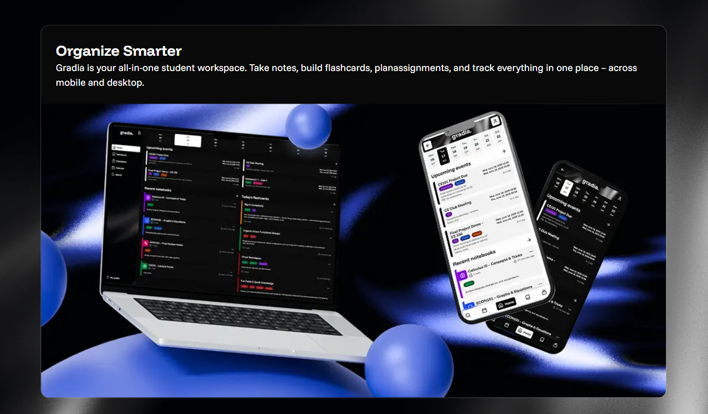
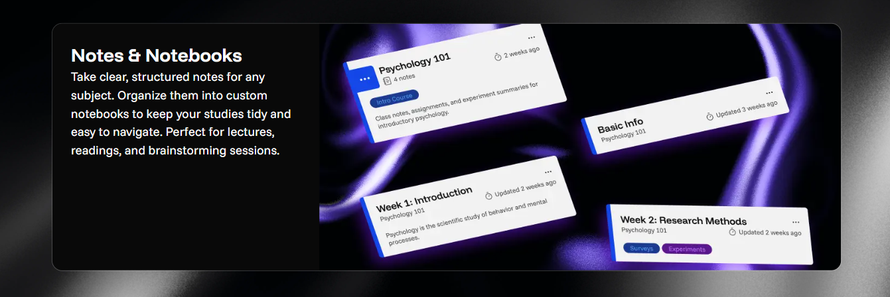
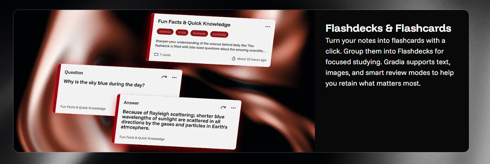
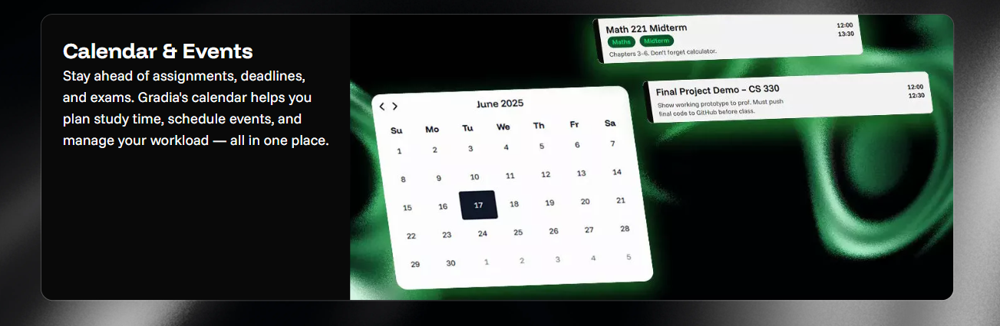

# Web Development Project: Student Organiser

#### Developed over one semester using TypeScript.

#### Key Features:
  - Notebooks for organizing notes, featuring a built-in Markdown editor
  - Calendar with support for event creation and management
  - Flashdecks: interactive flashcard sets for study and review
  - All user data and entities are private

#### To get started, follow the instructions in the `README.md` files located in the `backend` and `frontend` directories.

Unfortunately does not work on firefox.

#### Team Members:
Natália Ligačová, Jana Kmošková, Tomáš Bokor, Jozef Hoschek, Andrej Bugár
